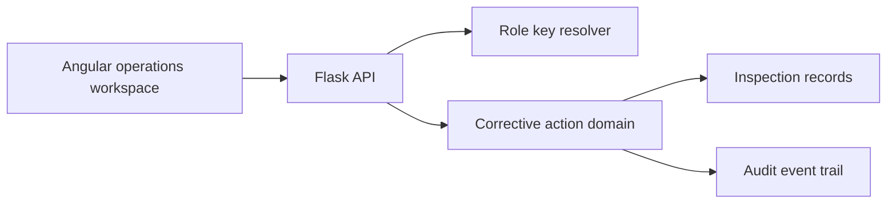
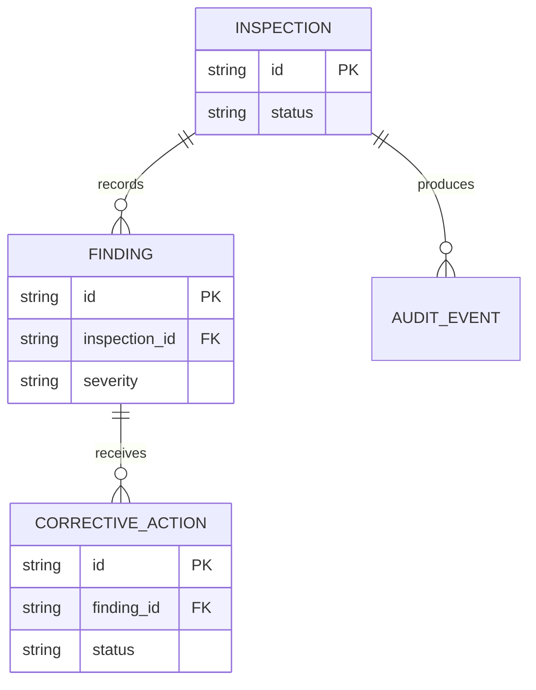
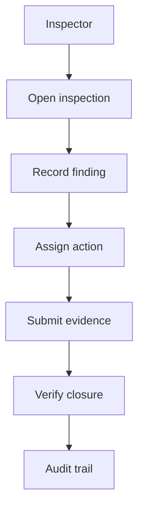
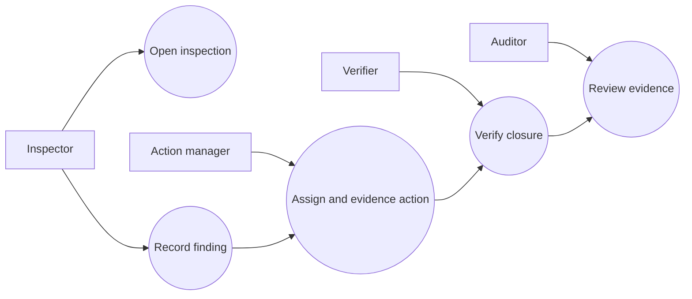
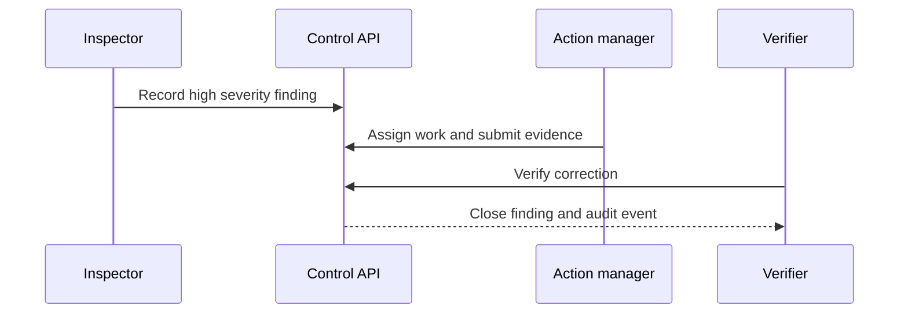

# SiteCorrect Control

## The Problem

Inspection teams frequently record observations in one system while corrective work, evidence, and verification are handled through disconnected messages. Managers cannot reliably establish whether a high severity field issue has been assigned, corrected, and independently verified.

## The Solution

SiteCorrect Control is an Angular and Flask platform for opening field inspections, recording findings, assigning corrective actions, collecting completion evidence, and closing findings after independent verification. Each lifecycle change produces an accountable audit event.

## Live Demo & Tech Stack

The Flask API runs on `http://localhost:11500` and binds to `0.0.0.0`. The Angular operations workspace runs locally on `http://localhost:11501` and proxies API calls to Flask.

| Area | Implementation |
| --- | --- |
| Operations UI | Angular 21 standalone application |
| API and domain | Python 3.12 and Flask 3.1 |
| Authorization | Role-specific access keys |
| Persistence contract | SQL migration for inspections, findings, actions, and audits |
| Quality | Python unittest suite, Angular production build, Docker, and CI |

Local workflow keys are `inspector-local`, `action-manager-local`, `verifier-local`, and `auditor-local`. Production environments should provide separate secret values through the documented environment variables and terminate TLS at an approved reverse proxy.

## Local Setup & Run Instructions

Use two terminals after cloning the repository.

```bash
git clone https://github.com/kholipha-ahmmad-al-amin/angular-flask-construction-inspection-corrective-action-platform.git
cd angular-flask-construction-inspection-corrective-action-platform
python3 -m unittest discover -s tests -v
PORT=11500 python3 backend/app.py
```

```bash
cd frontend
npm ci
npm run build
npm start
```

Open `http://localhost:11501`. Use the Inspector role to open an inspection and record a finding. Use Action manager to assign work and submit evidence. Use Verifier to close the action. Use Audit observer to inspect the evidence trail.

```bash
docker compose up --build
```

## System Documentation (Mermaid.js)

### Architecture


### ERD


### Data Flow


### Use Case


### Sequence


## Owner
Created and maintained by Kholipha Ahmmad Al-Amin.
Software Engineer and AI Specialist
Founder and CEO of EquiSaaS BD
Principal Consultant at AR IT Consultancy
Full Stack Developer and SaaS Product Builder
### Official links
Portfolio: https://kholipha-ahmmad-al-amin.equisaas-bd.com/
GitHub: https://github.com/kholipha-ahmmad-al-amin
LinkedIn: https://www.linkedin.com/in/kholipha-ahmmad-al-amin
X: https://x.com/al_amin5519
Facebook: https://www.facebook.com/kholipha.ahmmad.al.amin
Instagram: https://www.instagram.com/kholipha.ahmmad.al.amin
## Ownership
This project was created and is maintained by Kholipha Ahmmad Al-Amin.
